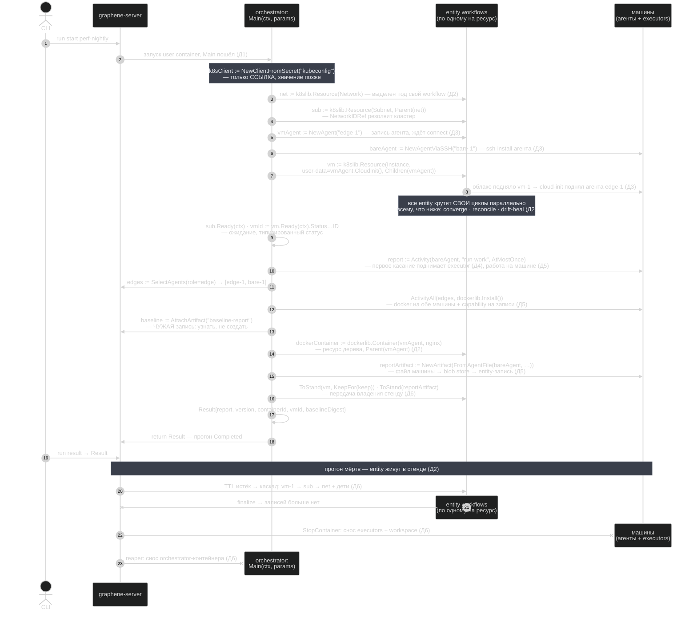
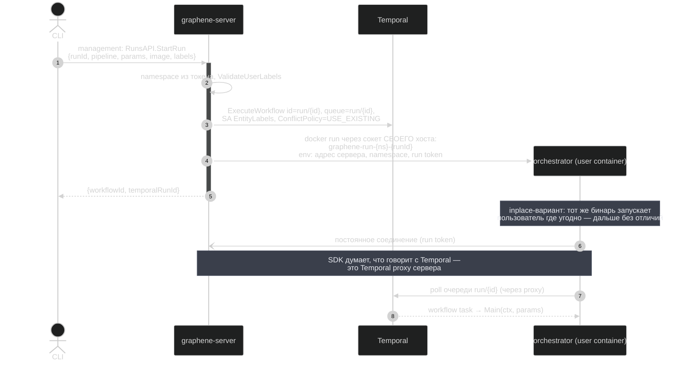
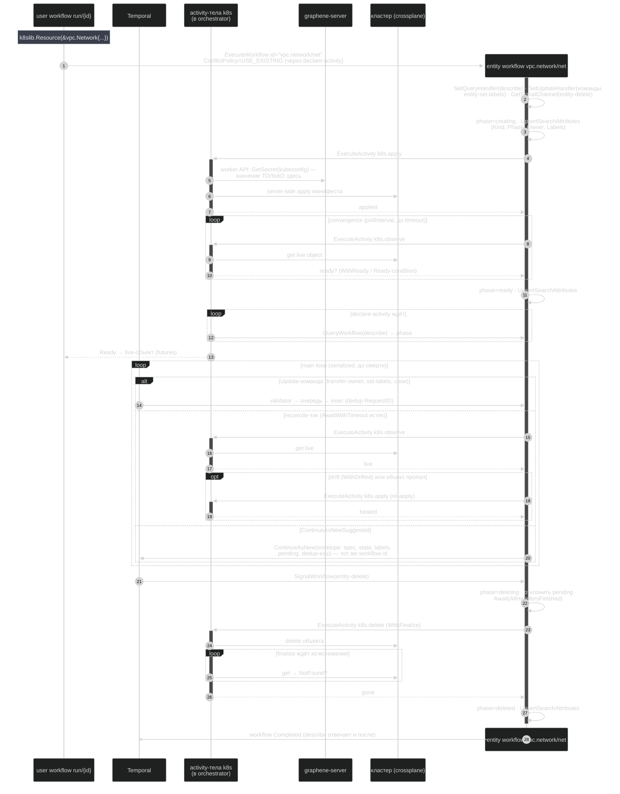
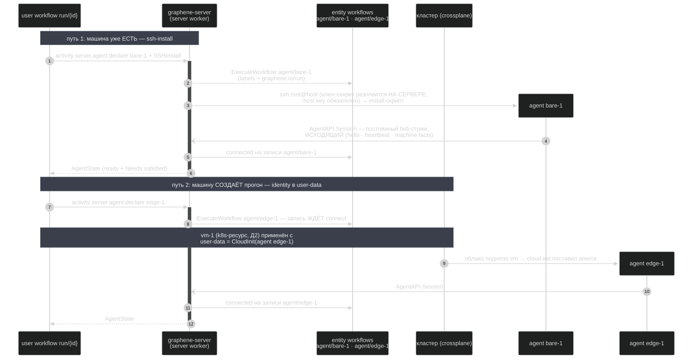
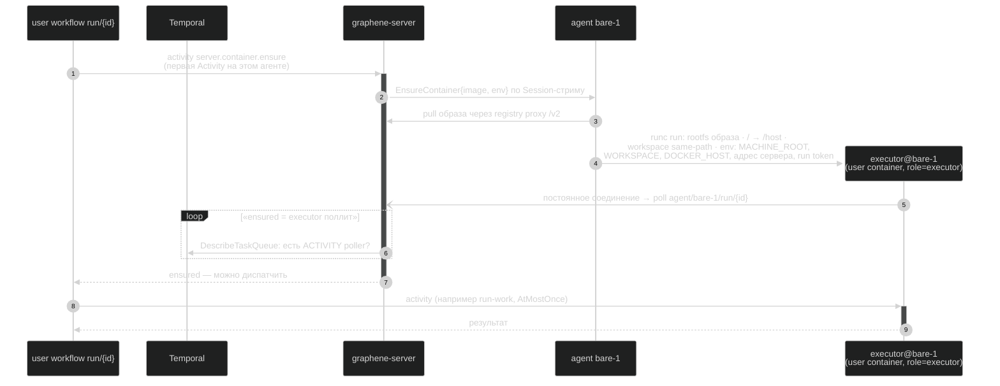
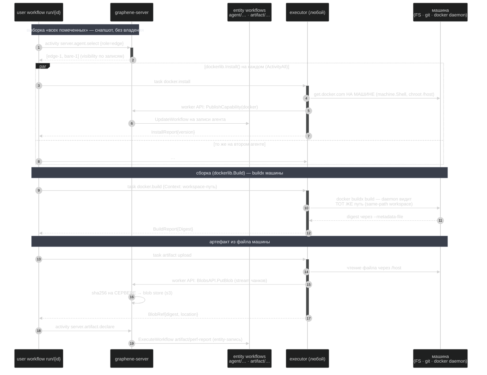
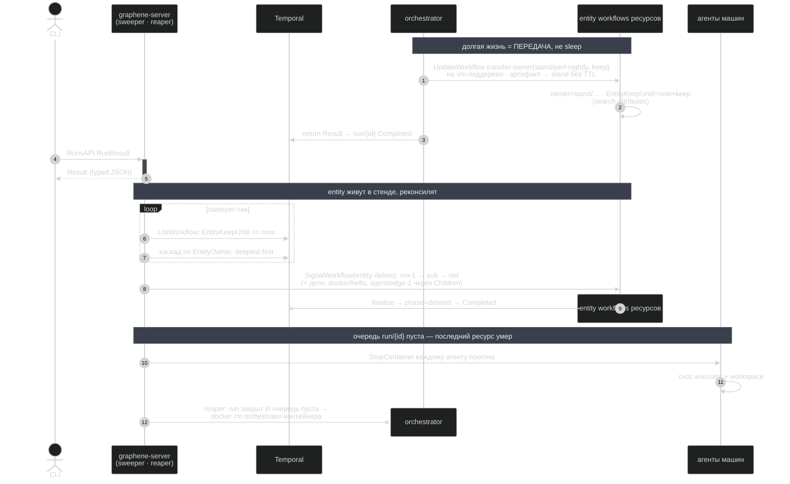

# examples/full (perf-nightly): полная последовательность вызовов

Рабочий файл: как ЭТОТ пример исполняется от `graphene run start` до
уборки. Термины и сетевая связанность — ниже, затем один сплошной
timeline без искусственной сегментации.

## Терминология

| Термин | Что это |
|---|---|
| **API Gateway** | Единственный вход graphene-server (`:7233`): за ним management API, worker API, agent API, Temporal proxy, registry proxy. Никто, кроме сервера, Temporal не видит. |
| **user container** | ОДИН образ/бинарь пользователя (этот `main.go`). Работает в двух ролях: **orchestrator** — крутит workflow прогона и библиотечные activities (k8s-ресурсы: kubeconfig не покидает его контур); **executor** — исполняет machine-activities на машине агента. |
| **agent** | Наш процесс на машине + её запись (entity). Исходящее соединение к Gateway, сеть не слушает. |
| **machine** | Само железо/VM. Агент = полный доступ уровня пользователя машины; контейнер executor'а — упаковка, не изоляция (`/host`, workspace same-path, `DOCKER_HOST`). |
| **server worker** | Temporal worker внутри graphene-server: системные activities (`server.agent.*`, `server.container.*`, `server.artifact.*`) и entity-записи agent/artifact. |

## Поверхности API за Gateway

Один порт `:7233` (cmux делит по содержимому запроса). TLS — прокси
перед Gateway (caddy: `reverse_proxy h2c://host:7233`).

| API | Протокол | Кто зовёт | Auth | Где определено |
|---|---|---|---|---|
| **management** — RunsAPI, ResourcesAPI, NamespacesAPI, SecretsAPI | ConnectRPC (connect-JSON / gRPC-Web / gRPC) | CLI, UI, graphene-ci-cloud | admin/run token `[@ns]` | `graphene/proto/management/v1` |
| **worker API** — SecretsAPI, CapabilitiesAPI, BlobsAPI (стриминг) | gRPC | user container (обе роли, из тел activities) | run token | `pipeline/proto/workerplane/v1` |
| **agent API** — AgentAPI (bidi-стрим Session) | gRPC | graphene-agent (только исходящее) | agent token (`agentId:token`) | `agent/proto/agent/v1` |
| **Temporal proxy** — WorkflowService | gRPC (unknown-service handler) | user container (SDK обеих ролей) | run token | `graphene/internal/temporalproxy` |
| **registry proxy** — `/v2/*` | HTTP | агент (pull), docker push | agent/run/admin token | `graphene/internal/httpapi` |
| **probes** — `/healthz`, `/healthz/*`, grpc.health.v1 | HTTP + gRPC | балансировщики, kubelet | без токена | `httpapi` + `probes` |

CLI пользователя работает ТОЛЬКО с management API (connect-go клиент).
Остальное — внутренние контуры системы.

## Стрелки

- `-)` — установление ПОСТОЯННОГО сетевого соединения (bidi-стрим, dial+poll);
- `->>` — вызов (RPC / activity / команда);
- `-->>` — ответ / результат.

## Общая картина: main.go (perf-nightly) сверху вниз

Ход именно этого файла, строка за строкой, в общих словах — механика
каждого шага в детальных диаграммах Д1–Д6.

## Д1. Старт прогона (managed)

## Д2. Выделение ресурса и жизнь его entity workflow

Объявление ресурса в user workflow не создаёт его «в себе»: ресурс
выделяется в ОТДЕЛЬНЫЙ top-level workflow (по одному на ресурс),
живущий своим циклом дольше прогона (child умер бы вместе с ним).
Принадлежность — ownership tree в search attributes. Здесь k8s-ресурс;
agent/artifact-записи — те же entity, только их activity-тела крутит
server worker.

## Д3. Подключение машины: два пути агента

## Д4. Первое касание машины: executor

## Д5. Machine-activities: работа, установка, сборка, артефакт

## Д6. Завершение, стенд, уборка

## Дыры поверхности (для грумминга CLI)

Минимальный CLI = 1:1 management API: `run start|get|result|cancel|list`,
`res list|get|tree|delete|transfer|invoke`, `ns`, `secret` (+`-l k=v`).

1. **Нет стрима** — наблюдение за прогоном только поллингом
   GetRun/List; нужен RunsAPI.WatchRun / ResourcesAPI.Watch.
2. **Нет логов** — stdout executor'ов лежит у агента, orchestrator'а —
   в docker; наружу не отдаётся ничем.
3. **Нет событий прогона** — «что сейчас происходит» есть только в
   Temporal history, management её не проксирует.
4. **Нет манифеста пайплайна** ([?9]) — CLI нечего показать про
   pipeline до запуска (Params/Result/ресурсы).
